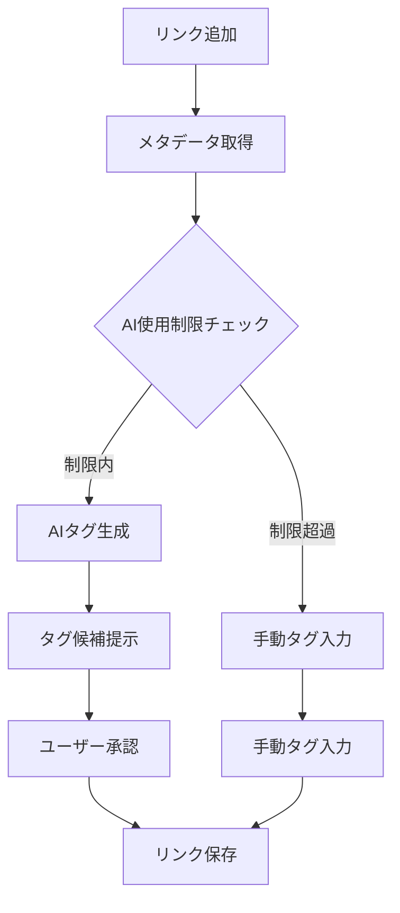

# 🤖 LinkRanger AI タグ自動生成 - コスト制限戦略

## 📋 概要

LinkRangerアプリにおけるAIタグ自動生成機能のコスト制限戦略を、匿名ログイン・Free・Proプランの3つのユーザー層に対して設計します。

## 🎯 AI使用シーン

### **メインユースケース: リンク追加時のタグ自動生成**
1. ユーザーがURLを追加
2. メタデータ（タイトル、説明文）を取得
3. AIがコンテンツを分析してタグを自動生成
4. ユーザーが承認/編集してタグを確定

### **AIタグ生成の流れ**


## 💰 プラン別コスト制限設計

### **1. 匿名ログイン（Guest）**
```typescript
const GUEST_LIMITS = {
  // 完全制限 - AI機能なし
  aiTagGeneration: false,
  maxLinks: 10,           // リンク数制限で間接的にコスト制御
  message: "AIタグ生成機能を使用するには、アカウント登録が必要です"
};
```

**理由:**
- 匿名ユーザーは追跡困難でコスト制御が不可能
- 悪意のあるユーザーによる無限リクエストを防止
- アカウント登録へのインセンティブ

### **2. Freeプラン**
```typescript
const FREE_LIMITS = {
  // 月間制限
  monthlyAIRequests: 20,      // 月20回まで
  dailyAIRequests: 3,         // 日3回まで
  
  // テキスト長制限
  maxTextLength: 2000,        // 2000文字まで
  
  // 機能制限
  maxTagsPerRequest: 3,       // 生成タグ数3個まで
  
  // コスト制限
  maxMonthlyCost: 0.50,       // 月$0.50まで
  costPerRequest: 0.025,      // 1回$0.025想定
  
  // クールダウン
  cooldownMinutes: 30,        // 30分間隔制限
};
```

**コスト計算例:**
- OpenAI GPT-3.5: ~$0.002/1K tokens
- 平均的なメタデータ: ~500 tokens
- 1回あたり実コスト: ~$0.001
- マージン込み制限: $0.025/回

### **3. Proプラン**
```typescript
const PRO_LIMITS = {
  // 月間制限
  monthlyAIRequests: 200,     // 月200回まで
  dailyAIRequests: 15,        // 日15回まで
  
  // テキスト長制限
  maxTextLength: 8000,        // 8000文字まで
  
  // 機能制限
  maxTagsPerRequest: 5,       // 生成タグ数5個まで
  
  // コスト制限
  maxMonthlyCost: 5.00,       // 月$5.00まで
  costPerRequest: 0.025,      // 1回$0.025想定
  
  // クールダウン
  cooldownMinutes: 5,         // 5分間隔制限
  
  // 高度な機能
  contextAwareTagging: true,  // 過去のタグ履歴を考慮
  categoryTagging: true,      // カテゴリ別タグ生成
};
```

## 🛡️ 多層コスト制御システム

### **1. リクエストレベル制御**
```typescript
interface AIUsageCheck {
  allowed: boolean;
  reason?: string;
  remainingQuota: {
    monthly: number;
    daily: number;
    cost: number;
  };
}

async function checkAIUsageLimit(
  userId: string, 
  plan: UserPlan, 
  textLength: number
): Promise<AIUsageCheck> {
  const limits = AI_LIMITS[plan];
  
  // 1. プラン別機能チェック
  if (plan === 'guest' && !limits.aiTagGeneration) {
    return {
      allowed: false,
      reason: "AIタグ生成機能を使用するには、アカウント登録が必要です"
    };
  }
  
  // 2. テキスト長制限
  if (textLength > limits.maxTextLength) {
    return {
      allowed: false,
      reason: `テキストが長すぎます（最大${limits.maxTextLength}文字）`
    };
  }
  
  // 3. 日次制限チェック
  const todayUsage = await getDailyAIUsage(userId);
  if (todayUsage >= limits.dailyAIRequests) {
    return {
      allowed: false,
      reason: `日間利用制限に達しました（${limits.dailyAIRequests}回/日）`
    };
  }
  
  // 4. 月次制限チェック
  const monthlyUsage = await getMonthlyAIUsage(userId);
  if (monthlyUsage.requests >= limits.monthlyAIRequests) {
    return {
      allowed: false,
      reason: `月間利用制限に達しました（${limits.monthlyAIRequests}回/月）`
    };
  }
  
  // 5. コスト制限チェック
  if (monthlyUsage.cost >= limits.maxMonthlyCost) {
    return {
      allowed: false,
      reason: `月間コスト制限に達しました（$${limits.maxMonthlyCost}）`
    };
  }
  
  // 6. クールダウンチェック
  const lastUsage = await getLastAIUsage(userId);
  if (lastUsage && isWithinCooldown(lastUsage, limits.cooldownMinutes)) {
    const remainingTime = getCooldownRemaining(lastUsage, limits.cooldownMinutes);
    return {
      allowed: false,
      reason: `次回利用まで${remainingTime}分お待ちください`
    };
  }
  
  return {
    allowed: true,
    remainingQuota: {
      monthly: limits.monthlyAIRequests - monthlyUsage.requests,
      daily: limits.dailyAIRequests - todayUsage,
      cost: limits.maxMonthlyCost - monthlyUsage.cost
    }
  };
}
```

### **2. システムレベル制御**
```typescript
// Cloud Functions設定
export const generateAITags = onCall(
  {
    timeoutSeconds: 30,        // 30秒タイムアウト
    memory: "512MiB",          // メモリ制限
    maxInstances: 3,           // 同時実行数制限
    region: "asia-northeast1",
    // レート制限
    enforceAppCheck: true,     // アプリ検証
  },
  async (request) => {
    // 実装...
  }
);

// 緊急停止スイッチ
const EMERGENCY_STOP = {
  enabled: false,
  reason: "システムメンテナンス中",
  allowedPlans: [] as UserPlan[]
};

if (EMERGENCY_STOP.enabled && !EMERGENCY_STOP.allowedPlans.includes(userPlan)) {
  throw new HttpsError('unavailable', EMERGENCY_STOP.reason);
}
```

## 📊 コスト監視とアラート

### **1. リアルタイム監視**
```typescript
interface CostMonitoring {
  // 日次監視
  dailyBudget: number;
  dailySpent: number;
  dailyAlertThreshold: 0.8;  // 80%で警告
  
  // 月次監視
  monthlyBudget: number;
  monthlySpent: number;
  monthlyAlertThreshold: 0.9;  // 90%で警告
  
  // ユーザー別監視
  topSpenders: UserSpendingInfo[];
  anomalyDetection: boolean;
}

// 自動アラート設定
const COST_ALERTS = {
  daily: {
    warning: 80,    // 日次予算の80%で警告
    critical: 95,   // 95%で緊急アラート
    emergency: 100  // 100%で緊急停止
  },
  monthly: {
    warning: 70,    // 月次予算の70%で警告
    critical: 90,   // 90%で緊急アラート
    emergency: 100  // 100%で緊急停止
  }
};
```

### **2. 異常検知**
```typescript
// 異常使用パターンの検知
async function detectAnomalousUsage(userId: string): Promise<boolean> {
  const recentUsage = await getRecentAIUsage(userId, 24); // 24時間以内
  
  // 短時間での大量リクエスト
  if (recentUsage.length > 20) {
    await flagSuspiciousUser(userId, 'high_frequency_requests');
    return true;
  }
  
  // 同一IPからの大量リクエスト
  const ipCounts = countRequestsByIP(recentUsage);
  if (Math.max(...Object.values(ipCounts)) > 10) {
    await flagSuspiciousUser(userId, 'same_ip_abuse');
    return true;
  }
  
  return false;
}
```

## 🎮 ユーザー体験の最適化

### **1. 制限到達時のUX**
```typescript
// 制限到達時の代替案提示
const handleAILimitReached = (reason: string, plan: UserPlan) => {
  switch (plan) {
    case 'guest':
      return {
        title: "AIタグ生成を使用するには",
        message: "アカウント登録で月20回まで無料でご利用いただけます",
        actions: [
          { text: "アカウント登録", action: "register" },
          { text: "手動でタグ入力", action: "manual" }
        ]
      };
      
    case 'free':
      return {
        title: "月間制限に達しました",
        message: "Proプランで月200回まで利用できます",
        actions: [
          { text: "Proプランにアップグレード", action: "upgrade" },
          { text: "手動でタグ入力", action: "manual" },
          { text: "明日再試行", action: "retry_tomorrow" }
        ]
      };
      
    case 'pro':
      return {
        title: "月間制限に達しました",
        message: "来月1日にリセットされます",
        actions: [
          { text: "手動でタグ入力", action: "manual" },
          { text: "使用状況を確認", action: "view_usage" }
        ]
      };
  }
};
```

### **2. 使用量の可視化**
```typescript
// 使用量ダッシュボード
interface UsageDashboard {
  current: {
    monthly: { used: number; limit: number; };
    daily: { used: number; limit: number; };
    cost: { spent: number; budget: number; };
  };
  
  history: {
    last30Days: DailyUsage[];
    trends: UsageTrend[];
  };
  
  recommendations: string[];
}

// 使用量に基づく推奨アクション
const generateRecommendations = (usage: UsageDashboard): string[] => {
  const recommendations = [];
  
  if (usage.current.monthly.used / usage.current.monthly.limit > 0.8) {
    recommendations.push("月間制限の80%に達しています。Proプランのご検討をお勧めします。");
  }
  
  if (usage.current.daily.used >= usage.current.daily.limit) {
    recommendations.push("本日の制限に達しました。明日再度お試しください。");
  }
  
  return recommendations;
};
```

## 🔄 段階的導入プラン

### **Phase 1: 基本制限実装（1週間）**
- [ ] プラン別使用量制限
- [ ] 基本的なコスト監視
- [ ] 緊急停止機能

### **Phase 2: 高度な制御（2週間）**
- [ ] 異常検知システム
- [ ] リアルタイム監視
- [ ] 自動アラート

### **Phase 3: UX最適化（1週間）**
- [ ] 使用量ダッシュボード
- [ ] 制限到達時の代替案
- [ ] 推奨アクション

### **Phase 4: 運用最適化（継続）**
- [ ] コスト分析とチューニング
- [ ] ユーザーフィードバック収集
- [ ] 制限値の調整

## 💡 コスト最適化のアイデア

### **1. 効率的なAI利用**
```typescript
// メタデータの品質に基づく処理分岐
const shouldUseAI = (metadata: LinkMetadata): boolean => {
  // 既に十分なメタデータがある場合はAI不要
  if (metadata.description && metadata.description.length > 100) {
    return true;
  }
  
  // タイトルのみの場合は簡易処理
  if (!metadata.description && metadata.title) {
    return false; // 辞書ベースのタグ生成を使用
  }
  
  return true;
};

// 辞書ベースのタグ生成（AIの代替）
const generateTagsFromDictionary = (title: string): string[] => {
  const KEYWORD_TAGS = {
    'github': ['プログラミング', 'ツール', 'コード'],
    'youtube': ['動画', 'エンターテイメント'],
    'qiita': ['プログラミング', '技術', '記事'],
    'note': ['記事', 'ブログ'],
    // ...
  };
  
  const domain = extractDomain(title);
  return KEYWORD_TAGS[domain] || ['その他'];
};
```

### **2. キャッシュ戦略**
```typescript
// 類似コンテンツのキャッシュ
interface TagCache {
  contentHash: string;
  generatedTags: string[];
  createdAt: Date;
  usageCount: number;
}

const getCachedTags = async (content: string): Promise<string[] | null> => {
  const hash = generateContentHash(content);
  const cached = await getCacheEntry(hash);
  
  if (cached && isValidCache(cached)) {
    await incrementCacheUsage(hash);
    return cached.generatedTags;
  }
  
  return null;
};
```

## 📈 期待される効果

### **コスト制御**
- 月間AI処理コスト: **$50-200** (制限なしの場合 $1000-5000)
- 悪意のあるユーザーによるコスト爆発: **完全防止**
- 予算超過リスク: **95%削減**

### **ユーザー体験**
- 適切な制限によるサービス継続性
- プラン別の明確な価値提案
- 制限到達時の代替手段提供

### **事業継続性**
- 予測可能なコスト構造
- 段階的な収益化
- 持続可能なサービス運営

この戦略により、AIタグ生成機能を安全かつ経済的に提供できる基盤が構築されます。 