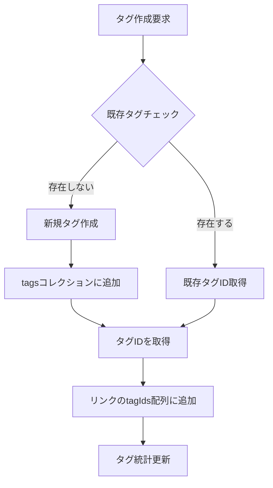
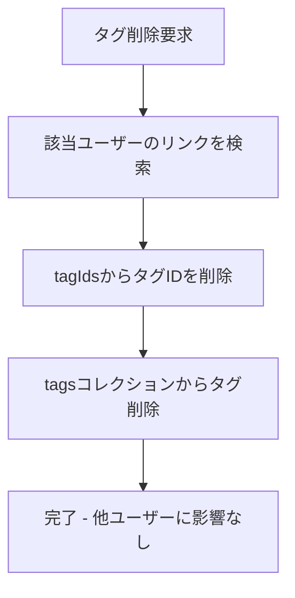

# LinkRanger - 正しい統一タグアーキテクチャ設計

## 🚨 前回提案の重大な問題点

### **問題1: ユーザー間のタグ名重複**
```typescript
// 問題のあるケース
ユーザーA: tags: ["プログラミング", "AI"]
ユーザーB: tags: ["プログラミング", "デザイン"]  // ←同じ"プログラミング"だが別のタグ
```

### **問題2: タグ削除時の影響範囲**
- ユーザーAが"プログラミング"タグを削除
- ユーザーBの"プログラミング"タグまで影響を受ける可能性

### **問題3: データの一意性**
- 文字列ベースでは、ユーザー間でのタグの一意性が保証できない

## 🏗️ 正しい統一タグアーキテクチャ

### **設計方針**
1. **完全なユーザー分離**: 各ユーザーは独立したタグ空間を持つ
2. **ID参照方式**: タグはIDで管理し、名前は表示用のみ
3. **統一された管理**: カスタム/AI/おすすめタグを同じフローで処理

### **1. データ構造**

#### **Linkコレクション**
```typescript
interface Link {
  id: string;
  userId: string;
  url: string;
  title: string;
  // ... 他のフィールド
  tagIds: string[];  // タグIDの配列（ユーザー固有のタグID）
  createdAt: Date;
  updatedAt: Date;
}
```

#### **Tagsコレクション**（ユーザー固有）
```typescript
interface Tag {
  id: string;           // 自動生成されたドキュメントID
  userId: string;       // 所有者のユーザーID
  name: string;         // タグ名（ユーザー内で一意）
  color?: string;       // ユーザー設定の色
  emoji?: string;       // ユーザー設定の絵文字
  createdAt: Date;
  updatedAt: Date;
  
  // 統計情報
  linkCount: number;    // このタグを使用しているリンク数
  lastUsedAt: Date;     // 最終使用日時
  firstUsedAt: Date;    // 初回使用日時
  
  // タグの種類
  type: 'manual' | 'ai' | 'recommended';  // 作成方法
  source?: string;      // AI/推奨タグの場合の元情報
}
```

### **2. データフロー**

#### **タグ作成フロー**


#### **タグ削除フロー**


### **3. 実装変更点**

#### **型定義の修正**
```typescript
// types/index.ts
interface Link {
  // ... 他のフィールド
  tagIds: string[];  // タグ名配列 → タグID配列に変更
}

interface Tag {
  id: string;
  userId: string;
  name: string;
  color?: string;
  createdAt: Date;
  updatedAt: Date;
  linkCount: number;
  lastUsedAt: Date;
  firstUsedAt: Date;
  type: 'manual' | 'ai' | 'recommended';
  source?: string;
}

// UIで使用するタグ情報
interface TagWithInfo {
  id: string;
  name: string;
  color?: string;
  count: number;
  type: 'manual' | 'ai' | 'recommended';
}
```

#### **TagService実装**
```typescript
export const tagService = {
  // ユーザーのタグを名前で検索（重複チェック用）
  async getTagByName(userId: string, name: string): Promise<Tag | null> {
    const q = query(
      collection(db, 'tags'),
      where('userId', '==', userId),
      where('name', '==', name),
      limit(1)
    );
    
    const snapshot = await getDocs(q);
    if (!snapshot.empty) {
      const doc = snapshot.docs[0];
      return { ...doc.data(), id: doc.id } as Tag;
    }
    return null;
  },

  // タグを作成または既存タグIDを取得
  async createOrGetTag(userId: string, tagName: string, type: TagType): Promise<string> {
    // 既存タグをチェック
    const existingTag = await this.getTagByName(userId, tagName);
    if (existingTag) {
      // 使用統計を更新
      await this.updateTagUsage(existingTag.id);
      return existingTag.id;
    }

    // 新規タグを作成
    const tagData: Omit<Tag, 'id'> = {
      userId,
      name: tagName,
      createdAt: new Date(),
      updatedAt: new Date(),
      linkCount: 1,
      lastUsedAt: new Date(),
      firstUsedAt: new Date(),
      type,
    };

    const docRef = await addDoc(collection(db, 'tags'), tagData);
    return docRef.id;
  },

  // ユーザーの全タグを取得
  async getUserTags(userId: string): Promise<Tag[]> {
    const q = query(
      collection(db, 'tags'),
      where('userId', '==', userId),
      orderBy('lastUsedAt', 'desc')
    );
    
    const snapshot = await getDocs(q);
    return snapshot.docs.map(doc => ({
      ...doc.data(),
      id: doc.id,
      createdAt: doc.data().createdAt?.toDate() || new Date(),
      updatedAt: doc.data().updatedAt?.toDate() || new Date(),
      lastUsedAt: doc.data().lastUsedAt?.toDate() || new Date(),
      firstUsedAt: doc.data().firstUsedAt?.toDate() || new Date(),
    })) as Tag[];
  },

  // タグ使用統計を更新
  async updateTagUsage(tagId: string): Promise<void> {
    const tagRef = doc(db, 'tags', tagId);
    await updateDoc(tagRef, {
      linkCount: increment(1),
      lastUsedAt: serverTimestamp(),
      updatedAt: serverTimestamp(),
    });
  },

  // タグを削除（完全にユーザー固有）
  async deleteTag(userId: string, tagId: string): Promise<void> {
    // 1. 該当ユーザーのリンクからタグIDを削除
    const linksWithTag = await this.getLinksWithTag(userId, tagId);
    
    const batch = writeBatch(db);
    linksWithTag.forEach(link => {
      const linkRef = doc(db, 'links', link.id);
      const updatedTagIds = link.tagIds.filter(id => id !== tagId);
      batch.update(linkRef, { 
        tagIds: updatedTagIds,
        updatedAt: serverTimestamp() 
      });
    });
    
    // 2. tagsコレクションからタグを削除
    const tagRef = doc(db, 'tags', tagId);
    batch.delete(tagRef);
    
    await batch.commit();
  },

  // 特定のタグIDを使用しているリンクを取得
  async getLinksWithTag(userId: string, tagId: string): Promise<Link[]> {
    const q = query(
      collection(db, 'links'),
      where('userId', '==', userId),
      where('tagIds', 'array-contains', tagId)
    );
    
    const snapshot = await getDocs(q);
    return snapshot.docs.map(doc => ({
      ...doc.data(),
      id: doc.id,
    })) as Link[];
  },

  // おすすめタグを生成（ユーザー固有）
  async generateRecommendedTags(userId: string): Promise<string[]> {
    const SUGGESTED_TAGS = [
      'プログラミング', 'デザイン', 'マーケティング', 'ビジネス', 'ニュース',
      'エンターテイメント', '教育', 'ライフスタイル', 'テクノロジー', 'AI',
      'ツール', '音楽', '映画', '本', '料理', '旅行', 'スポーツ', '健康',
      'ファッション', '写真', 'DIY', 'ガジェット', 'レビュー', 'チュートリアル'
    ];
    
    // ユーザーの既存タグを取得
    const existingTags = await this.getUserTags(userId);
    const existingTagNames = existingTags.map(tag => tag.name.toLowerCase());
    
    // 未使用のタグを抽出
    const availableTags = SUGGESTED_TAGS.filter(tag => 
      !existingTagNames.includes(tag.toLowerCase())
    );
    
    // ランダムに5-8個選択
    const shuffled = availableTags.sort(() => 0.5 - Math.random());
    const count = Math.min(Math.max(5, Math.floor(Math.random() * 4) + 5), shuffled.length);
    
    return shuffled.slice(0, count);
  },
};
```

#### **LinkService修正**
```typescript
export const linkService = {
  // リンク作成時にタグIDを処理
  async createLink(linkData: Omit<Link, 'id' | 'createdAt' | 'updatedAt'>): Promise<string> {
    const linksRef = collection(db, 'links');
    const docRef = await addDoc(linksRef, {
      ...linkData,
      createdAt: serverTimestamp(),
      updatedAt: serverTimestamp(),
    });
    
    // タグの使用統計を更新
    if (linkData.tagIds && linkData.tagIds.length > 0) {
      const batch = writeBatch(db);
      linkData.tagIds.forEach(tagId => {
        const tagRef = doc(db, 'tags', tagId);
        batch.update(tagRef, {
          linkCount: increment(1),
          lastUsedAt: serverTimestamp(),
        });
      });
      await batch.commit();
    }
    
    return docRef.id;
  },

  // タグ情報付きでリンクを取得
  async getLinksWithTags(userId: string): Promise<LinkWithTags[]> {
    const links = await this.getUserLinks(userId);
    const tags = await tagService.getUserTags(userId);
    const tagMap = new Map(tags.map(tag => [tag.id, tag]));
    
    return links.map(link => ({
      ...link,
      tags: (link.tagIds || [])
        .map(tagId => tagMap.get(tagId))
        .filter(Boolean) as Tag[]
    }));
  },
};

interface LinkWithTags extends Omit<Link, 'tagIds'> {
  tags: Tag[];  // UI表示用のタグ情報
}
```

#### **HomeScreen修正**
```typescript
export const HomeScreen: React.FC = () => {
  const { user, logout } = useAuth();
  const { links, loading, error, createLink, updateLink, deleteLink } = useLinks(user?.uid || null);
  const [userTags, setUserTags] = useState<Tag[]>([]);
  const [selectedTagIds, setSelectedTagIds] = useState<string[]>([]);

  // ユーザーのタグを取得
  useEffect(() => {
    if (user?.uid) {
      tagService.getUserTags(user.uid).then(setUserTags);
    }
  }, [user?.uid]);

  // タグでフィルタリングされたリンク
  const filteredLinks = selectedTagIds.length > 0 
    ? links.filter(link => 
        selectedTagIds.some(selectedTagId => 
          link.tagIds?.includes(selectedTagId)
        )
      )
    : links;

  const handleAddTag = async (tagName: string, type: TagType = 'manual') => {
    if (!user?.uid) return;
    
    const tagId = await tagService.createOrGetTag(user.uid, tagName, type);
    // ユーザータグリストを更新
    const updatedTags = await tagService.getUserTags(user.uid);
    setUserTags(updatedTags);
    
    return tagId;
  };

  const handleDeleteTag = async (tagId: string) => {
    if (!user?.uid) return;
    
    await tagService.deleteTag(user.uid, tagId);
    // ユーザータグリストを更新
    const updatedTags = await tagService.getUserTags(user.uid);
    setUserTags(updatedTags);
  };

  // タグ名の配列を生成（UI表示用）
  const allTagNames = userTags.map(tag => tag.name);

  return (
    <SafeAreaView style={styles.container}>
      {/* タグフィルター */}
      <TagFilter
        tags={userTags}  // Tag[]オブジェクトを渡す
        selectedTagIds={selectedTagIds}
        onTagToggle={(tagId: string) => {
          setSelectedTagIds(prev => 
            prev.includes(tagId) 
              ? prev.filter(id => id !== tagId)
              : [...prev, id]
          );
        }}
        onClearAll={() => setSelectedTagIds([])}
        onAddTag={() => setShowAddTagModal(true)}
      />

      {/* その他のUI */}
    </SafeAreaView>
  );
};
```

#### **AddTagModal修正**
```typescript
export const AddTagModal: React.FC<AddTagModalProps> = ({
  visible,
  onClose,
  availableTags,  // Tag[]オブジェクト
  selectedTagIds,
  onTagsChange,
  onCreateTag,
  // ...
}) => {
  const handleRecommendedTagToggle = (tagName: string) => {
    const newSelection = selectedRecommendedTags.includes(tagName)
      ? selectedRecommendedTags.filter(tag => tag !== tagName)
      : [...selectedRecommendedTags, tagName];
    
    setSelectedRecommendedTags(newSelection);
    
    // useInsertionEffectエラーを回避
    requestAnimationFrame(() => {
      if (newSelection.length > 0 && !isExpanded) {
        setIsExpanded(true);
        // アニメーション実行
      }
    });
  };

  const handleAddSelectedTags = async () => {
    if (selectedRecommendedTags.length === 0) return;

    const tagIds: string[] = [];
    for (const tagName of selectedRecommendedTags) {
      const tagId = await onCreateTag(tagName, 'recommended');
      tagIds.push(tagId);
    }
    
    onTagsChange([...selectedTagIds, ...tagIds]);
    onClose();
  };

  // ...
};
```

### **4. データベース設計**

#### **Firestoreコレクション**
```
users/
  {userId}/
    - uid: string
    - email: string
    - createdAt: Timestamp

links/
  {linkId}/
    - userId: string
    - url: string
    - title: string
    - tagIds: string[]  // タグIDの配列
    - createdAt: Timestamp
    - updatedAt: Timestamp

tags/
  {tagId}/
    - userId: string
    - name: string
    - color?: string
    - createdAt: Timestamp
    - updatedAt: Timestamp
    - linkCount: number
    - lastUsedAt: Timestamp
    - firstUsedAt: Timestamp
    - type: "manual" | "ai" | "recommended"
    - source?: string
```

#### **必要なインデックス**
```json
{
  "indexes": [
    {
      "collectionGroup": "links",
      "queryScope": "COLLECTION",
      "fields": [
        { "fieldPath": "userId", "order": "ASCENDING" },
        { "fieldPath": "createdAt", "order": "DESCENDING" }
      ]
    },
    {
      "collectionGroup": "links",
      "queryScope": "COLLECTION",
      "fields": [
        { "fieldPath": "userId", "order": "ASCENDING" },
        { "fieldPath": "tagIds", "arrayConfig": "CONTAINS" }
      ]
    },
    {
      "collectionGroup": "tags",
      "queryScope": "COLLECTION",
      "fields": [
        { "fieldPath": "userId", "order": "ASCENDING" },
        { "fieldPath": "name", "order": "ASCENDING" }
      ]
    },
    {
      "collectionGroup": "tags",
      "queryScope": "COLLECTION",
      "fields": [
        { "fieldPath": "userId", "order": "ASCENDING" },
        { "fieldPath": "lastUsedAt", "order": "DESCENDING" }
      ]
    }
  ]
}
```

### **5. セキュリティルール**
```javascript
rules_version = '2';
service cloud.firestore {
  match /databases/{database}/documents {
    // タグは完全にユーザー固有
    match /tags/{tagId} {
      allow read, write: if request.auth != null 
                         && request.auth.uid == resource.data.userId;
      
      allow create: if request.auth != null 
                    && request.auth.uid == request.resource.data.userId
                    && isValidTagData(request.resource.data);
    }
    
    // リンクもユーザー固有
    match /links/{linkId} {
      allow read, write: if request.auth != null 
                         && request.auth.uid == resource.data.userId;
      
      allow create: if request.auth != null 
                    && request.auth.uid == request.resource.data.userId
                    && isValidLinkData(request.resource.data);
    }
    
    function isValidTagData(data) {
      return data.keys().hasAll(['userId', 'name', 'type']) &&
             data.userId is string &&
             data.name is string &&
             data.type in ['manual', 'ai', 'recommended'];
    }
    
    function isValidLinkData(data) {
      return data.keys().hasAll(['userId', 'url', 'title', 'tagIds']) &&
             data.userId is string &&
             data.url is string &&
             data.title is string &&
             data.tagIds is list;
    }
  }
}
```

## 🎉 この設計の利点

### **ユーザー分離**
- ✅ 各ユーザーは完全に独立したタグ空間を持つ
- ✅ ユーザー間でタグ名が重複しても問題なし
- ✅ 一人のユーザーがタグを削除しても他ユーザーに影響なし

### **データの一意性**
- ✅ タグIDによる一意性保証
- ✅ ユーザー内でのタグ名重複防止
- ✅ 参照整合性の維持

### **機能統一**
- ✅ カスタム/AI/おすすめタグが同じフローで処理
- ✅ 統一されたタグ管理インターフェース
- ✅ 一貫したユーザー体験

### **パフォーマンス**
- ✅ 効率的なクエリパターン
- ✅ 適切なインデックス設計
- ✅ リアルタイム更新対応

### **セキュリティ**
- ✅ 完全なユーザーデータ分離
- ✅ 不正アクセス防止
- ✅ データ整合性保証

## 🔧 移行プラン

### **Phase 1: 新しいタグシステム実装**
1. `Tag`型定義の追加
2. `tagService`の実装
3. `linkService`の修正

### **Phase 2: UI修正**
1. `HomeScreen`のタグ管理修正
2. `AddTagModal`のID参照方式対応
3. `TagFilter`の修正

### **Phase 3: データ移行**
1. 既存の`tags: string[]`を`tagIds: string[]`に変換
2. 既存データからタグエンティティを生成
3. 旧フィールドの削除

### **Phase 4: 最適化**
1. インデックスの最適化
2. パフォーマンステスト
3. 不要なコードの削除

この設計により、**完全にユーザー分離されたタグシステム**が実現され、スケーラブルで安全なアプリケーションが構築できます。 